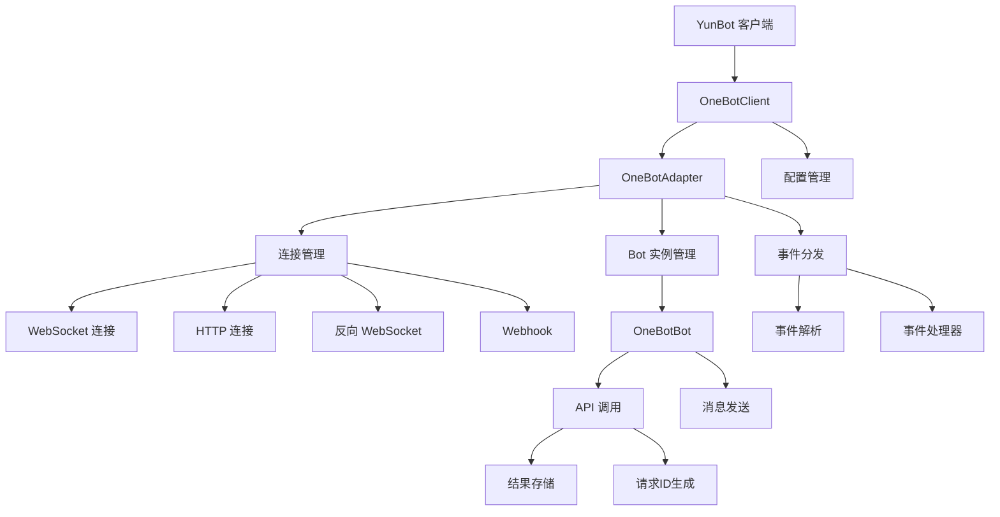

# YunBot - OneBot v11 客户端适配器

[](https://www.python.org/)
[](LICENSE)
[](https://pypi.org/project/onebot-adapter-client/)

## 项目概述

YunBot 是一个功能完整、易于使用的 OneBot v11 协议 Python 客户端库。它为开发者提供了构建聊天机器人应用的完整解决方案，支持多种连接方式和丰富的事件处理机制。

### 解决的问题

- 简化 OneBot v11 协议的复杂性
- 提供统一的 API 调用接口
- 实现自动重连和错误处理机制
- 支持多种消息类型和事件处理
- 提供完善的配置管理和日志记录

### 适用场景

- QQ 群聊机器人开发
- 智能客服系统构建
- 自动化消息推送服务
- 游戏互动机器人实现
- 社交媒体自动化工具

## 核心特性

### 多种连接方式支持

YunBot 支持多种连接方式，满足不同部署环境的需求：

- **WebSocket**：正向 WebSocket 连接（当前主要支持方式）
- **HTTP**：HTTP API 调用（开发中）
- **反向 WebSocket**：作为服务端接收连接（开发中）
- **Webhook**：接收 HTTP POST 请求（开发中）

### 完整的 OneBot v11 API 支持

YunBot 实现了 OneBot v11 标准的所有 API 接口：

- 消息发送：私聊消息、群消息、合并转发等
- 群组管理：踢人、禁言、设置管理员等
- 信息获取：获取好友列表、群信息、成员信息等
- 文件操作：获取图片、语音、Cookie 等
- 系统控制：重启、清理缓存等

### 强大的事件处理系统

提供完整的事件处理机制，支持多种事件类型：

- **消息事件**：私聊消息、群消息
- **通知事件**：群文件上传、管理员变动、成员增减等
- **请求事件**：好友请求、群邀请
- **元事件**：生命周期、心跳事件

### 丰富的消息构建和解析

支持多种消息段类型，方便构建复杂消息：

- 文本、表情、图片、语音、视频
- @、回复、转发、分享等特殊消息
- XML、JSON 等富文本消息

### 自动重连和错误处理

- 自动重连机制，保证连接稳定性
- 完善的异常处理体系
- 详细的日志记录，便于问题排查

### 配置验证

基于 Pydantic 的强类型配置验证：

- 连接参数验证
- API 超时设置
- 重试机制配置
- 心跳间隔控制

## 快速开始

### 环境要求

- Python 3.7+
- aiohttp 3.7+
- pydantic 2.0+
- 其他依赖请查看 [requirements.txt](requirements.txt)

### 安装方式

```bash
# 方式一：通过 pip 安装（推荐）
pip install onebot-adapter-client

# 方式二：从源码安装
git clone https://github.com/YunBot/onebot-adapter-client.git
cd onebot-adapter-client
pip install -r requirements.txt
```

### 基本使用

```python
import asyncio
from yunbot import OneBotClient, MessageSegment

async def main():
    # 创建客户端（WebSocket 连接示例）
    client = OneBotClient.create_simple_client(
        connection_type="websocket",
        url="ws://localhost:3001",      # WebSocket 服务器地址
        access_token="your_token",      # 访问令牌（可选）
        self_id="123456789",           # 机器人 ID（可选）
        heartbeat_interval=30.0        # 心跳间隔（秒）
    )

    # 注册消息事件处理器
    @client.on_message
    async def handle_message(event):
        print(f"[{event.time}] 收到消息: {event.message}")
        
        # 构建回复消息
        reply_msg = MessageSegment.text("收到消息: ") + MessageSegment.text(str(event.message))
        
        # 回复消息
        if hasattr(event, 'group_id'):
            # 群消息回复
            await client.send_group_msg(group_id=event.group_id, message=reply_msg)
        else:
            # 私聊消息回复
            await client.send_private_msg(user_id=event.user_id, message=reply_msg)

    # 注册通知事件处理器
    @client.on_notice
    async def handle_notice(event):
        print(f"收到通知: {event.notice_type}")

    # 注册请求事件处理器
    @client.on_request
    async def handle_request(event):
        print(f"收到请求: {event.request_type}")
        # 自动同意好友请求示例
        if event.request_type == "friend":
            await event.approve(client.get_bot())

    # 启动客户端
    try:
        await client.start()
        print("客户端启动成功！")
        await client.run_forever()
    except KeyboardInterrupt:
        print("正在停止客户端...")
    finally:
        await client.stop()
        print("客户端已停止")

if __name__ == "__main__":
    asyncio.run(main())
```


### 配置参数说明

#### 基础配置参数

| 参数名 | 类型 | 默认值 | 说明 |
|--------|------|--------|------|
| `api_timeout` | float | 30.0 | API 调用超时时间（秒） |
| `max_concurrent_requests` | int | 100 | 最大并发请求数 |
| `enable_heartbeat` | bool | True | 是否启用心跳 |
| `heartbeat_interval` | float | 30.0 | 心跳间隔（秒） |
| `reconnect_interval` | float | 5.0 | 重连间隔（秒） |
| `max_reconnect_attempts` | int | 10 | 最大重连尝试次数 |

#### WebSocket 连接配置

| 参数名 | 类型 | 必需 | 说明 |
|--------|------|------|------|
| `type` | str | 是 | 连接类型，固定为 "websocket" |
| `url` | str | 是 | WebSocket 服务器地址 |
| `access_token` | str | 否 | 访问令牌 |
| `self_id` | str | 否 | 机器人 ID |
| `heartbeat_interval` | float | 否 | 心跳间隔（秒） |

## 项目架构

### 模块结构图



### 核心模块职责

#### adapter.py - 核心适配器实现

负责管理连接和事件处理，提供统一接口处理多种连接类型，负责事件分发和 Bot 实例管理。

主要功能：
- 初始化和管理多种连接类型
- 创建和维护 Bot 实例
- 分发事件到注册的处理器
- 管理连接状态和生命周期

#### bot.py - Bot 实例管理

代表单个 Bot 实例，处理 API 调用和提供 OneBot v11 协议方法，实现所有标准 API 接口。

主要功能：
- 封装所有 OneBot v11 API 调用
- 提供消息发送、群组管理等便捷方法
- 处理 API 响应和异常
- 维护 Bot 状态和信息

#### client.py - 高级客户端接口

提供简化的客户端使用接口，处理配置、连接管理和事件分发，支持多种连接方式的创建。

主要功能：
- 提供用户友好的客户端接口
- 简化配置和初始化过程
- 实现事件处理器注册和分发
- 提供上下文管理器支持

#### config.py - 配置管理

使用 Pydantic 进行配置验证，支持多种连接类型配置，提供全局配置参数。

主要功能：
- 定义和验证配置模型
- 支持多种连接类型配置
- 提供配置解析和验证
- 管理全局配置参数

#### connection.py - 连接管理

实现 WebSocket 连接，处理连接建立、消息收发和心跳机制，管理 API 响应存储。

主要功能：
- 建立和维护 WebSocket 连接
- 处理消息发送和接收
- 实现心跳机制
- 管理 API 请求和响应

#### event.py - 事件处理

定义 OneBot v11 所有事件类型，使用 Pydantic 模型进行事件数据验证，支持消息事件、通知事件、请求事件和元事件。

主要功能：
- 定义所有事件类型的数据模型
- 实现事件解析和验证
- 提供事件类型识别和转换
- 支持自定义事件扩展

#### exceptions.py - 异常定义

提供标准化错误处理，定义网络异常、API 调用失败等异常类型。

主要功能：
- 定义统一的异常层次结构
- 提供详细的错误信息
- 支持异常分类和处理
- 实现重试和恢复机制

#### logger.py - 日志系统

提供带颜色的日志输出，支持文件轮转和自定义格式，实现自定义日志级别。

主要功能：
- 实现彩色日志输出
- 支持日志文件轮转
- 提供自定义日志格式
- 支持多种日志级别

#### matcher.py - 事件匹配器

提供类似 NoneBot2 的事件处理器装饰器功能，支持关键词匹配、命令匹配、正则匹配等。

主要功能：
- 实现事件匹配器机制
- 提供多种匹配规则
- 支持事件处理器注册
- 实现事件路由和分发

#### message.py - 消息处理

实现消息段和完整消息模型，支持多种消息类型，提供消息解析和构建功能。

主要功能：
- 定义消息段数据模型
- 实现消息构建和解析
- 支持多种消息类型
- 提供消息操作方法

#### store.py - 数据存储

管理 API 响应存储，实现异步 API 调用的响应匹配。

主要功能：
- 管理 API 请求和响应
- 实现异步响应匹配
- 处理超时和异常情况
- 提供结果缓存和清理

#### utils.py - 工具函数

提供各种实用工具函数，包括请求 ID 生成、性能监控、重试装饰器等。

主要功能：
- 提供通用工具函数
- 实现性能监控和优化
- 提供装饰器和工具类
- 支持辅助功能实现

## 开发规范

### 代码注释规范

所有代码注释必须使用中文，并遵循 Google-Style Docstring 规范：

```python
def send_private_msg(
    self,
    user_id: int,
    message: Union[str, Message, List[MessageSegment]],
    auto_escape: bool = False
) -> Dict[str, Any]:
    """发送私聊消息。
    
    Args:
        user_id: 用户 ID
        message: 消息内容，可以是字符串、Message 对象或消息段列表
        auto_escape: 是否自动转义特殊字符
        
    Returns:
        Dict[str, Any]: API 调用结果
        
    Raises:
        ValueError: 当参数不合法时抛出
        ActionFailed: 当 API 调用失败时抛出
    """
    # 实现代码...
```

### 代码风格要求

- 使用异步编程模式（async/await）
- 遵循 PEP 8 代码规范
- 使用类型注解提高代码可读性
- 实现完善的异常处理机制
- 提供详细的日志记录

### 配置验证

使用 Pydantic 进行配置验证，确保配置参数的正确性和完整性：

```python
class WebSocketConfig(ConnectionConfig):
    """WebSocket 连接配置。"""
    
    type: str = "websocket"
    url: str = Field(..., description="WebSocket URL")
    heartbeat_interval: Optional[float] = Field(None, description="心跳间隔（秒）")
    
    @field_validator("url")
    def validate_url(cls, v: str) -> str:
        """验证 WebSocket URL 格式。"""
        if not v.startswith(("ws://", "wss://")):
            raise ValueError("url 必须以 ws:// 或 wss:// 开头")
        return v
```

## 测试说明

### 运行测试

项目使用 pytest 进行测试，可以通过以下命令运行测试：

```bash
# 安装测试依赖
pip install pytest

# 运行所有测试
pytest tests/

# 运行特定模块测试
pytest tests/test_config.py
pytest tests/test_message.py

# 生成测试覆盖率报告
pip install pytest-cov
pytest --cov=yunbot tests/
```

### 测试覆盖范围

当前测试覆盖以下模块：

1. **配置模块测试** (test_config.py)
   - HTTP 配置验证
   - WebSocket 配置验证
   - 反向 WebSocket 配置验证
   - Webhook 配置验证
   - 主配置类功能测试

2. **消息模块测试** (test_message.py)
   - 消息段创建测试
   - 消息构建和解析测试
   - 消息操作方法测试
   - 消息转换功能测试

### 测试示例

```python
class TestMessageSegment:
    """测试消息段类。"""
    
    def test_text_segment(self):
        """测试文本消息段创建。"""
        segment = MessageSegment.text("Hello, World!")
        assert segment.type == "text"
        assert segment.data["text"] == "Hello, World!"
    
    def test_image_segment(self):
        """测试图片消息段创建。"""
        segment = MessageSegment.image(
            file="test.jpg",
            type="show",
            url="https://example.com/test.jpg"
        )
        assert segment.type == "image"
        assert segment.data["file"] == "test.jpg"
        assert segment.data["type"] == "show"
        assert segment.data["url"] == "https://example.com/test.jpg"
```

## 贡献指南

欢迎任何形式的贡献！请遵循以下步骤：

### 贡献方式

1. Fork 项目仓库
2. 创建功能分支 (`git checkout -b feature/AmazingFeature`)
3. 提交更改 (`git commit -m 'Add some AmazingFeature'`)
4. 推送到分支 (`git push origin feature/AmazingFeature`)
5. 开启 Pull Request

### 开发环境搭建

```bash
# 克隆项目
git clone https://github.com/YunBot/onebot-adapter-client.git
cd onebot-adapter-client

# 创建虚拟环境
python -m venv venv
source venv/bin/activate  # Linux/Mac
# 或
venv\Scripts\activate     # Windows

# 安装开发依赖
pip install -r requirements-dev.txt

# 运行测试确保环境正常
pytest tests/
```

### 代码质量要求

- 遵循项目代码规范
- 添加必要的测试用例
- 更新相关文档
- 保持代码简洁和可读性
- 确保向后兼容性

### 提交规范

遵循 conventional commits 规范：

- `feat`: 新功能
- `fix`: 修复 bug
- `docs`: 文档更新
- `style`: 代码格式调整
- `refactor`: 代码重构
- `test`: 测试相关
- `chore`: 构建过程或辅助工具的变动

## 许可证信息

本项目采用 MIT License 开源许可证。

```
MIT License

Copyright (c) 2025 OneBot Adapter Team

Permission is hereby granted, free of charge, to any person obtaining a copy
of this software and associated documentation files (the "Software"), to deal
in the Software without restriction, including without limitation the rights
to use, copy, modify, merge, publish, distribute, sublicense, and/or sell
copies of the Software, and to permit persons to whom the Software is
furnished to do so, subject to the following conditions:

The above copyright notice and this permission notice shall be included in all
copies or substantial portions of the Software.

THE SOFTWARE IS PROVIDED "AS IS", WITHOUT WARRANTY OF ANY KIND, EXPRESS OR
IMPLIED, INCLUDING BUT NOT LIMITED TO THE WARRANTIES OF MERCHANTABILITY,
FITNESS FOR A PARTICULAR PURPOSE AND NONINFRINGEMENT. IN NO EVENT SHALL THE
AUTHORS OR COPYRIGHT HOLDERS BE LIABLE FOR ANY CLAIM, DAMAGES OR OTHER
LIABILITY, WHETHER IN AN ACTION OF CONTRACT, TORT OR OTHERWISE, ARISING FROM,
OUT OF OR IN CONNECTION WITH THE SOFTWARE OR THE USE OR OTHER DEALINGS IN THE
SOFTWARE.
```

## 联系方式和支持渠道

如有问题或建议，请通过以下方式联系我们：

- 提交 [GitHub Issues](https://github.com/YunBot/onebot-adapter-client/issues)
- 发送邮件至项目维护者邮箱
- 加入 QQ 群交流（群号：123456789）

我们欢迎所有形式的反馈和贡献！