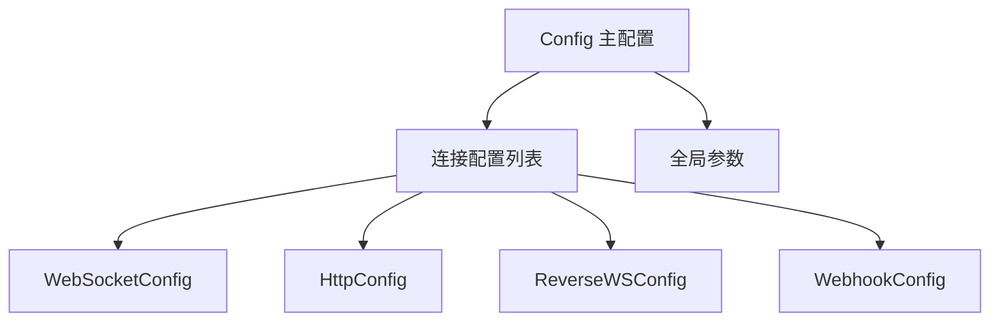

# 配置管理

## 概述

YunBot 使用 Pydantic 进行配置管理,提供强类型验证和完善的错误提示。本指南介绍如何配置客户端的各种参数。

## 配置系统架构



## 配置方式

### 方式一: 使用工厂方法 (推荐)

最简单的配置方式,适用于单连接场景。

```python
from yunbot import OneBotClient

client = OneBotClient.create_simple_client(
    connection_type="websocket",
    url="ws://localhost:3001",
    access_token="your_token",
    heartbeat_interval=30.0
)
```

### 方式二: 使用配置文件

适用于复杂配置和生产环境。

**JSON 配置文件** (config.json):
```json
{
  "connections": [
    {
      "type": "websocket",
      "url": "ws://localhost:3001",
      "access_token": "your_token",
      "heartbeat_interval": 30.0
    }
  ],
  "api_timeout": 30.0,
  "max_concurrent_requests": 100,
  "enable_heartbeat": true,
  "heartbeat_interval": 30.0,
  "reconnect_interval": 5.0,
  "max_reconnect_attempts": 10
}
```

**YAML 配置文件** (config.yaml):
```yaml
connections:
  - type: websocket
    url: ws://localhost:3001
    access_token: your_token
    heartbeat_interval: 30.0

api_timeout: 30.0
max_concurrent_requests: 100
enable_heartbeat: true
heartbeat_interval: 30.0
reconnect_interval: 5.0
max_reconnect_attempts: 10
```

**使用配置文件创建客户端**:
```python
from yunbot import OneBotClient

client = OneBotClient.from_config_file("config.json")
# 或
client = OneBotClient.from_config_file("config.yaml")
```

### 方式三: 使用 Config 对象

适用于需要动态配置的场景。

```python
from yunbot import OneBotClient
from yunbot.config import Config, WebSocketConfig

# 创建连接配置
ws_config = WebSocketConfig(
    url="ws://localhost:3001",
    access_token="your_token",
    heartbeat_interval=30.0
)

# 创建主配置
config = Config(
    connections=[ws_config],
    api_timeout=30.0,
    max_concurrent_requests=100
)

# 创建客户端
client = OneBotClient(config)
```

## 配置参数详解

### 全局配置参数

主配置类 `Config` 包含以下全局参数:

| 参数 | 类型 | 默认值 | 说明 |
|------|------|--------|------|
| connections | List[ConnectionConfig] | [] | 连接配置列表 |
| api_timeout | float | 30.0 | API 调用超时时间(秒) |
| max_concurrent_requests | int | 100 | 最大并发请求数 |
| enable_heartbeat | bool | True | 是否启用心跳 |
| heartbeat_interval | float | 30.0 | 默认心跳间隔(秒) |
| reconnect_interval | float | 5.0 | 重连间隔(秒) |
| max_reconnect_attempts | int | 10 | 最大重连尝试次数 |

**示例**:
```python
from yunbot.config import Config, WebSocketConfig

config = Config(
    connections=[
        WebSocketConfig(url="ws://localhost:3001")
    ],
    api_timeout=60.0,              # API 超时 60 秒
    max_concurrent_requests=200,    # 最多 200 个并发请求
    enable_heartbeat=True,          # 启用心跳
    heartbeat_interval=30.0,        # 30 秒心跳间隔
    reconnect_interval=10.0,        # 10 秒重连间隔
    max_reconnect_attempts=5        # 最多重连 5 次
)
```

### WebSocket 连接配置

WebSocket 是当前主要支持的连接方式。

**配置类**: `WebSocketConfig`

| 参数 | 类型 | 必需 | 默认值 | 说明 |
|------|------|------|--------|------|
| type | str | 是 | "websocket" | 连接类型 |
| url | str | 是 | - | WebSocket URL (ws:// 或 wss://) |
| access_token | str | 否 | None | 访问令牌 |
| heartbeat_interval | float | 否 | None | 心跳间隔(秒) |
| timeout | float | 否 | 30.0 | 连接超时(秒) |
| retry_times | int | 否 | 3 | 重试次数 |
| retry_interval | float | 否 | 1.0 | 重试间隔(秒) |

**示例**:
```python
from yunbot.config import WebSocketConfig

# 基础配置
ws_config = WebSocketConfig(
    url="ws://localhost:3001"
)

# 完整配置
ws_config = WebSocketConfig(
    url="ws://localhost:3001",
    access_token="my_secret_token",
    heartbeat_interval=30.0,
    timeout=60.0,
    retry_times=5,
    retry_interval=2.0
)

# 使用 wss:// (加密连接)
ws_config = WebSocketConfig(
    url="wss://example.com:3001",
    access_token="my_secret_token"
)
```

**URL 格式验证**:
- 必须以 `ws://` 或 `wss://` 开头
- 示例: `ws://127.0.0.1:3001`, `wss://example.com/onebot`

### HTTP 连接配置 (开发中)

HTTP 轮询方式,适用于无法使用 WebSocket 的环境。

**配置类**: `HttpConfig`

| 参数 | 类型 | 必需 | 默认值 | 说明 |
|------|------|------|--------|------|
| type | str | 是 | "http" | 连接类型 |
| base_url | str | 是 | - | HTTP API 基础 URL |
| access_token | str | 否 | None | 访问令牌 |
| timeout | float | 否 | 30.0 | 请求超时(秒) |

**示例**:
```python
from yunbot.config import HttpConfig

http_config = HttpConfig(
    base_url="http://localhost:5700",
    access_token="my_secret_token",
    timeout=30.0
)
```

### 反向 WebSocket 配置 (开发中)

作为服务器接收连接,适用于特殊部署场景。

**配置类**: `ReverseWebSocketConfig`

| 参数 | 类型 | 必需 | 默认值 | 说明 |
|------|------|------|--------|------|
| type | str | 是 | "reverse_ws" | 连接类型 |
| host | str | 否 | "127.0.0.1" | 监听地址 |
| port | int | 是 | - | 监听端口 |
| path | str | 否 | "/onebot/v11/ws" | WebSocket 路径 |
| access_token | str | 否 | None | 访问令牌 |

**示例**:
```python
from yunbot.config import ReverseWebSocketConfig

reverse_ws_config = ReverseWebSocketConfig(
    host="0.0.0.0",
    port=8080,
    path="/onebot/v11/ws",
    access_token="my_secret_token"
)
```

### Webhook 配置 (开发中)

接收 HTTP POST 请求,适用于事件驱动场景。

**配置类**: `WebhookConfig`

| 参数 | 类型 | 必需 | 默认值 | 说明 |
|------|------|------|--------|------|
| type | str | 是 | "webhook" | 连接类型 |
| host | str | 否 | "127.0.0.1" | 监听地址 |
| port | int | 是 | - | 监听端口 |
| path | str | 否 | "/onebot/v11/webhook" | Webhook 路径 |
| secret | str | 否 | None | 签名密钥 |

**示例**:
```python
from yunbot.config import WebhookConfig

webhook_config = WebhookConfig(
    host="0.0.0.0",
    port=8081,
    path="/webhook",
    secret="my_webhook_secret"
)
```

## 多连接配置

YunBot 支持同时配置多个连接,实现多机器人实例管理。

```python
from yunbot.config import Config, WebSocketConfig

config = Config(
    connections=[
        # Bot 1
        WebSocketConfig(
            url="ws://localhost:3001",
            access_token="token1"
        ),
        # Bot 2
        WebSocketConfig(
            url="ws://localhost:3002",
            access_token="token2"
        ),
    ]
)

client = OneBotClient(config)
await client.start()

# 获取所有 Bot
bots = client.get_bots()
for bot in bots:
    print(f"Bot ID: {bot.self_id}")
```

## 配置验证

YunBot 使用 Pydantic 进行配置验证,在配置错误时会抛出清晰的异常。

### URL 格式验证

```python
from yunbot.config import WebSocketConfig

# ❌ 错误: URL 格式不正确
try:
    config = WebSocketConfig(url="http://localhost:3001")
except ValueError as e:
    print(e)  # url must start with ws:// or wss://

# ✅ 正确
config = WebSocketConfig(url="ws://localhost:3001")
```

### 端口范围验证

```python
from yunbot.config import ReverseWebSocketConfig

# ❌ 错误: 端口超出范围
try:
    config = ReverseWebSocketConfig(port=99999)
except ValueError as e:
    print(e)  # port must be between 1 and 65535

# ✅ 正确
config = ReverseWebSocketConfig(port=8080)
```

### 必需参数验证

```python
from yunbot.config import WebSocketConfig

# ❌ 错误: 缺少必需参数
try:
    config = WebSocketConfig()
except ValueError as e:
    print(e)  # Field required

# ✅ 正确
config = WebSocketConfig(url="ws://localhost:3001")
```

## 完整配置示例

### 示例 1: 单机器人配置

```python
from yunbot import OneBotClient
from yunbot.config import Config, WebSocketConfig

# 使用配置对象
config = Config(
    connections=[
        WebSocketConfig(
            url="ws://localhost:3001",
            access_token="my_token",
            heartbeat_interval=30.0,
            timeout=60.0
        )
    ],
    api_timeout=30.0,
    max_concurrent_requests=100,
    enable_heartbeat=True,
    reconnect_interval=5.0,
    max_reconnect_attempts=10
)

client = OneBotClient(config)
```

### 示例 2: 多机器人配置

```python
from yunbot.config import Config, WebSocketConfig

config = Config(
    connections=[
        WebSocketConfig(
            url="ws://bot1.example.com:3001",
            access_token="token1",
            heartbeat_interval=30.0
        ),
        WebSocketConfig(
            url="ws://bot2.example.com:3002",
            access_token="token2",
            heartbeat_interval=30.0
        ),
    ],
    api_timeout=60.0,
    max_concurrent_requests=200
)
```

### 示例 3: 生产环境配置

**config.yaml**:
```yaml
# 连接配置
connections:
  - type: websocket
    url: wss://bot.example.com:3001
    access_token: ${BOT_TOKEN}  # 从环境变量读取
    heartbeat_interval: 30.0
    timeout: 60.0
    retry_times: 5
    retry_interval: 2.0

# 全局参数
api_timeout: 60.0
max_concurrent_requests: 200
enable_heartbeat: true
heartbeat_interval: 30.0
reconnect_interval: 10.0
max_reconnect_attempts: 5
```

**加载配置**:
```python
import os
from yunbot import OneBotClient

# 设置环境变量
os.environ["BOT_TOKEN"] = "production_token"

# 从配置文件加载
client = OneBotClient.from_config_file("config.yaml")
```

## 配置最佳实践

### 1. 使用环境变量存储敏感信息

```python
import os

# ✅ 推荐: 从环境变量读取 token
access_token = os.getenv("BOT_ACCESS_TOKEN")

client = OneBotClient.create_simple_client(
    connection_type="websocket",
    url="ws://localhost:3001",
    access_token=access_token
)

# ❌ 不推荐: 硬编码 token
client = OneBotClient.create_simple_client(
    connection_type="websocket",
    url="ws://localhost:3001",
    access_token="my_secret_token_123"
)
```

### 2. 分离开发和生产配置

```python
import os

env = os.getenv("ENV", "development")

if env == "production":
    client = OneBotClient.from_config_file("config.prod.yaml")
else:
    client = OneBotClient.from_config_file("config.dev.yaml")
```

### 3. 合理设置超时和重试

```python
from yunbot.config import Config, WebSocketConfig

# ✅ 推荐: 根据网络环境调整
config = Config(
    connections=[
        WebSocketConfig(
            url="ws://localhost:3001",
            timeout=60.0,          # 本地环境可以设置较长超时
            retry_times=3
        )
    ],
    api_timeout=30.0,
    reconnect_interval=5.0
)
```

### 4. 启用心跳保活

```python
# ✅ 推荐: 启用心跳
config = Config(
    connections=[
        WebSocketConfig(
            url="ws://localhost:3001",
            heartbeat_interval=30.0  # 30 秒心跳
        )
    ],
    enable_heartbeat=True
)
```

### 5. 限制并发请求

```python
# ✅ 推荐: 根据服务器能力设置并发限制
config = Config(
    connections=[...],
    max_concurrent_requests=100  # 最多 100 个并发请求
)
```

## 配置工具方法

### 获取特定类型的连接

```python
from yunbot.config import Config

config = Config(...)

# 获取 WebSocket 连接
ws_conn = config.get_connection_by_type("websocket")

# 获取多个类型的连接
conns = config.get_connections_by_types("websocket", "http")
```

## 注意事项

1. **URL 格式**: WebSocket URL 必须以 `ws://` 或 `wss://` 开头
2. **端口范围**: 端口必须在 1-65535 之间
3. **心跳间隔**: 建议设置为 30 秒,过短会增加网络开销
4. **超时设置**: API 超时建议设置为 30-60 秒
5. **重连策略**: 根据网络稳定性调整重连间隔和最大重连次数
6. **敏感信息**: 不要在代码中硬编码 access_token,使用环境变量或配置文件

## 相关文档

- [客户端使用](client.md) - 客户端的创建和管理
- [客户端 API](../api/client.md) - 客户端 API 参考
- [快速开始](../quickstart.md) - 快速开始教程
