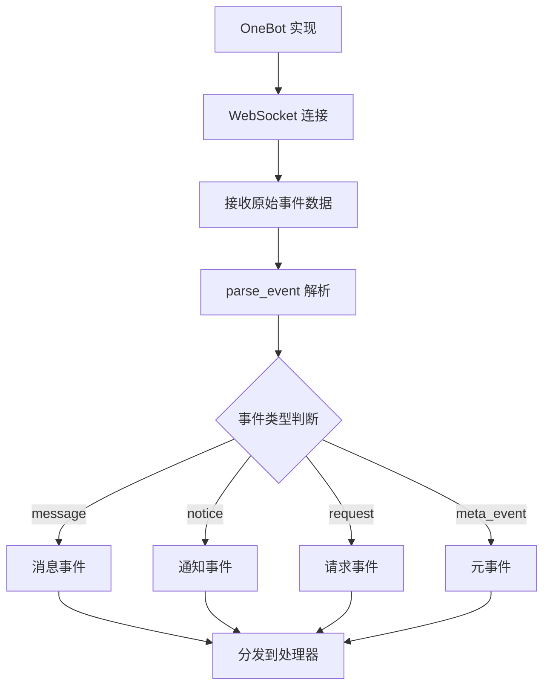

# 事件处理指南

本文档全面介绍 YunBot 的事件处理系统,包括事件类型、处理器注册和最佳实践。

## 事件系统概述

YunBot 的事件系统基于 OneBot v11 协议,将所有来自 OneBot 实现的数据都抽象为**事件(Event)**。事件系统提供了统一的接口来处理各类消息、通知、请求等。

### 事件流程



### 事件分类

YunBot 支持四大类事件:

| 事件类型 | 说明 | 典型用途 |
|---------|------|---------|
| **消息事件** | 私聊和群聊消息 | 处理用户发送的消息,实现聊天功能 |
| **通知事件** | 群成员变动、文件上传等 | 监控群组状态,自动化管理 |
| **请求事件** | 好友请求、加群请求 | 自动审批,权限管理 |
| **元事件** | 心跳、生命周期 | 监控机器人状态,连接管理 |

## 事件类型详解

### 消息事件 (MessageEvent)

消息事件是最常用的事件类型,包括私聊消息和群聊消息。

#### 私聊消息事件 (PrivateMessageEvent)

当收到私聊消息时触发。

**事件属性**:

| 属性 | 类型 | 说明 |
|------|------|------|
| `user_id` | int | 发送者 QQ 号 |
| `message` | Union[str, List] | 消息内容 |
| `message_id` | int | 消息 ID |
| `sender` | Sender | 发送者信息 |
| `raw_message` | str | 原始消息文本 |

**示例**:

```python
@client.on_message
async def handle_private_message(event):
    # 检查是否为私聊消息
    if not hasattr(event, 'group_id'):
        print(f"收到私聊消息来自 {event.user_id}")
        print(f"消息内容: {event.message}")
        print(f"发送者昵称: {event.sender.nickname}")
        
        # 回复私聊消息
        await client.send_private_msg(
            user_id=event.user_id,
            message="收到你的消息了!"
        )
```

#### 群聊消息事件 (GroupMessageEvent)

当收到群聊消息时触发。

**事件属性**:

| 属性 | 类型 | 说明 |
|------|------|------|
| `group_id` | int | 群号 |
| `user_id` | int | 发送者 QQ 号 |
| `message` | Union[str, List] | 消息内容 |
| `message_id` | int | 消息 ID |
| `sender` | Sender | 发送者信息(包含群名片、权限等) |
| `anonymous` | Anonymous | 匿名信息(如果是匿名消息) |

**示例**:

```python
@client.on_message
async def handle_group_message(event):
    # 检查是否为群消息
    if hasattr(event, 'group_id'):
        print(f"收到群 {event.group_id} 的消息")
        print(f"发送者: {event.sender.nickname}")
        print(f"群名片: {event.sender.card}")
        print(f"群权限: {event.sender.role}")  # owner/admin/member
        
        # 回复群消息
        await client.send_group_msg(
            group_id=event.group_id,
            message=f"@{event.sender.nickname} 收到你的消息!"
        )
```

### 通知事件 (NoticeEvent)

通知事件用于报告群组或好友状态的变化。

#### 群成员增加 (GroupIncreaseNoticeEvent)

当有新成员加入群聊时触发。

**事件属性**:

| 属性 | 类型 | 说明 |
|------|------|------|
| `group_id` | int | 群号 |
| `user_id` | int | 新成员 QQ 号 |
| `operator_id` | int | 操作者 QQ 号 |
| `sub_type` | str | approve(管理员同意)/invite(管理员邀请) |

**示例**:

```python
@client.on_notice
async def handle_group_increase(event):
    if event.notice_type == "group_increase":
        # 欢迎新成员
        welcome_msg = MessageSegment.at(event.user_id) + MessageSegment.text(" 欢迎加入本群!")
        await client.send_group_msg(
            group_id=event.group_id,
            message=welcome_msg
        )
```

#### 群成员减少 (GroupDecreaseNoticeEvent)

当群成员离开或被移出时触发。

**事件属性**:

| 属性 | 类型 | 说明 |
|------|------|------|
| `group_id` | int | 群号 |
| `user_id` | int | 离开成员 QQ 号 |
| `operator_id` | int | 操作者 QQ 号 |
| `sub_type` | str | leave(主动退群)/kick(被踢)/kick_me(机器人被踢) |

**示例**:

```python
@client.on_notice
async def handle_group_decrease(event):
    if event.notice_type == "group_decrease":
        if event.sub_type == "kick":
            # 有人被踢出群
            await client.send_group_msg(
                group_id=event.group_id,
                message=f"成员 {event.user_id} 被移出了群聊"
            )
```

#### 群禁言 (GroupBanNoticeEvent)

当群成员被禁言或解除禁言时触发。

**事件属性**:

| 属性 | 类型 | 说明 |
|------|------|------|
| `group_id` | int | 群号 |
| `user_id` | int | 被禁言用户 QQ 号 |
| `operator_id` | int | 操作者 QQ 号 |
| `duration` | int | 禁言时长(秒),0 表示解除禁言 |
| `sub_type` | str | ban(禁言)/lift_ban(解除禁言) |

#### 群文件上传 (GroupUploadNoticeEvent)

当群成员上传文件时触发。

**事件属性**:

| 属性 | 类型 | 说明 |
|------|------|------|
| `group_id` | int | 群号 |
| `user_id` | int | 上传者 QQ 号 |
| `file` | File | 文件信息(id, name, size) |

#### 其他通知事件

- `group_admin` - 群管理员变动
- `friend_add` - 好友添加成功
- `group_recall` - 群消息撤回
- `friend_recall` - 好友消息撤回

### 请求事件 (RequestEvent)

请求事件代表需要机器人处理的请求。

#### 好友请求 (FriendRequestEvent)

当收到好友添加请求时触发。

**事件属性**:

| 属性 | 类型 | 说明 |
|------|------|------|
| `user_id` | int | 请求者 QQ 号 |
| `comment` | str | 验证消息 |
| `flag` | str | 请求标识(用于处理请求) |

**示例**:

```python
@client.on_request
async def handle_friend_request(event):
    if event.request_type == "friend":
        print(f"收到好友请求: {event.user_id}")
        print(f"验证消息: {event.comment}")
        
        # 自动同意好友请求
        bot = client.get_bot()
        await event.approve(bot, remark="新朋友")
        
        # 或者使用 API 方法
        # await client.set_friend_add_request(
        #     flag=event.flag,
        #     approve=True,
        #     remark="新朋友"
        # )
```

#### 群请求 (GroupRequestEvent)

当收到加群请求或群邀请时触发。

**事件属性**:

| 属性 | 类型 | 说明 |
|------|------|------|
| `group_id` | int | 群号 |
| `user_id` | int | 请求者 QQ 号 |
| `comment` | str | 验证消息 |
| `flag` | str | 请求标识 |
| `sub_type` | str | add(加群请求)/invite(邀请机器人入群) |

**示例**:

```python
@client.on_request
async def handle_group_request(event):
    if event.request_type == "group":
        if event.sub_type == "add":
            # 处理加群请求
            print(f"收到加群请求: 用户 {event.user_id} 请求加入群 {event.group_id}")
            
            # 同意请求
            bot = client.get_bot()
            await event.approve(bot)
        
        elif event.sub_type == "invite":
            # 处理群邀请
            print(f"收到群邀请: 被邀请加入群 {event.group_id}")
            await event.approve(bot)
```

### 元事件 (MetaEvent)

元事件提供关于机器人自身状态的信息。

#### 心跳事件 (HeartbeatMetaEvent)

定期触发,报告机器人运行状态。

**事件属性**:

| 属性 | 类型 | 说明 |
|------|------|------|
| `status` | Dict | 机器人状态信息 |
| `interval` | int | 心跳间隔(毫秒) |

**示例**:

```python
@client.on_meta_event
async def handle_heartbeat(event):
    if event.meta_event_type == "heartbeat":
        status = event.status
        print(f"心跳 - 在线: {status.get('online')}, 状态: {status.get('good')}")
```

#### 生命周期事件 (LifecycleMetaEvent)

当机器人启用、禁用或连接时触发。

**事件属性**:

| 属性 | 类型 | 说明 |
|------|------|------|
| `sub_type` | str | enable(启用)/disable(禁用)/connect(连接) |

**示例**:

```python
@client.on_meta_event
async def handle_lifecycle(event):
    if event.meta_event_type == "lifecycle":
        if event.sub_type == "enable":
            print("机器人已启用")
        elif event.sub_type == "connect":
            print("WebSocket 连接已建立")
```

## 事件处理器注册

### 使用装饰器注册 (推荐)

装饰器方式是最直观和常用的方式:

```python
from yunbot import OneBotClient

client = OneBotClient.create_simple_client(
    connection_type="websocket",
    url="ws://localhost:3001"
)

# 注册消息事件处理器
@client.on_message
async def handle_message(event):
    print(f"收到消息: {event.message}")

# 注册通知事件处理器
@client.on_notice
async def handle_notice(event):
    print(f"收到通知: {event.notice_type}")

# 注册请求事件处理器
@client.on_request
async def handle_request(event):
    print(f"收到请求: {event.request_type}")

# 注册元事件处理器
@client.on_meta_event
async def handle_meta_event(event):
    print(f"收到元事件: {event.meta_event_type}")

# 注册通用事件处理器(所有事件)
@client.on_event
async def handle_all_events(event):
    print(f"收到事件: {event.post_type}")
```

### 使用方法注册

也可以先定义处理器函数,再手动注册:

```python
async def my_message_handler(event):
    print(f"收到消息: {event.message}")

# 注册处理器
client.on_message(my_message_handler)
```

### 注册多个处理器

可以为同一类型事件注册多个处理器,按注册顺序依次执行:

```python
@client.on_message
async def handler_1(event):
    print("处理器 1 执行")
    # 处理逻辑 1

@client.on_message
async def handler_2(event):
    print("处理器 2 执行")
    # 处理逻辑 2

# 收到消息时,两个处理器都会被调用
```

## 事件对象属性

### 公共属性

所有事件都包含以下公共属性:

| 属性 | 类型 | 说明 |
|------|------|------|
| `time` | datetime | 事件发生时间 |
| `self_id` | int | 机器人自己的 QQ 号 |
| `post_type` | str | 事件类型(message/notice/request/meta_event) |

### 访问事件属性

```python
@client.on_message
async def handle_message(event):
    # 公共属性
    print(f"事件时间: {event.time}")
    print(f"机器人 ID: {event.self_id}")
    print(f"事件类型: {event.post_type}")
    
    # 消息事件特有属性
    print(f"消息类型: {event.message_type}")  # private/group
    print(f"消息内容: {event.message}")
    print(f"发送者 ID: {event.user_id}")
    
    # 群消息特有属性
    if hasattr(event, 'group_id'):
        print(f"群号: {event.group_id}")
    
    # 发送者信息
    if event.sender:
        print(f"昵称: {event.sender.nickname}")
        print(f"性别: {event.sender.sex}")
        print(f"年龄: {event.sender.age}")
```

## 事件处理最佳实践

### 1. 区分事件类型

```python
@client.on_message
async def handle_message(event):
    # 区分私聊和群聊
    if hasattr(event, 'group_id'):
        # 群消息处理
        print(f"群 {event.group_id} 消息")
    else:
        # 私聊消息处理
        print(f"私聊消息来自 {event.user_id}")
```

### 2. 异常处理

```python
@client.on_message
async def handle_message(event):
    try:
        # 处理消息
        await process_message(event)
    except Exception as e:
        logger.error(f"处理消息出错: {e}")
        # 发送错误提示
        await client.send_private_msg(
            user_id=event.user_id,
            message="抱歉,处理您的消息时出错了"
        )
```

### 3. 使用类型检查

```python
from yunbot import MessageEvent, NoticeEvent

@client.on_event
async def handle_all_events(event):
    if isinstance(event, MessageEvent):
        # 处理消息事件
        await handle_message_event(event)
    elif isinstance(event, NoticeEvent):
        # 处理通知事件
        await handle_notice_event(event)
```

### 4. 提取纯文本内容

```python
def get_message_text(message):
    """从消息中提取纯文本"""
    if isinstance(message, str):
        return message
    elif isinstance(message, list):
        text = ""
        for seg in message:
            if isinstance(seg, dict) and seg.get("type") == "text":
                text += seg.get("data", {}).get("text", "")
        return text
    return str(message)

@client.on_message
async def handle_message(event):
    text = get_message_text(event.message)
    print(f"消息文本: {text}")
```

### 5. 权限检查

```python
# 定义管理员列表
ADMINS = [123456789, 987654321]

@client.on_message
async def handle_admin_command(event):
    # 检查是否为管理员
    if event.user_id not in ADMINS:
        await client.send_private_msg(
            user_id=event.user_id,
            message="您没有权限执行此操作"
        )
        return
    
    # 执行管理员操作
    await admin_operation(event)
```

### 6. 群权限检查

```python
@client.on_message
async def handle_group_command(event):
    if hasattr(event, 'group_id'):
        # 检查发送者权限
        role = event.sender.role
        if role in ["owner", "admin"]:
            # 管理员操作
            await admin_group_operation(event)
        else:
            await client.send_group_msg(
                group_id=event.group_id,
                message="此命令仅限管理员使用"
            )
```

## 完整示例

```python
import asyncio
from yunbot import OneBotClient, MessageSegment

async def main():
    client = OneBotClient.create_simple_client(
        connection_type="websocket",
        url="ws://localhost:3001"
    )
    
    # 消息事件处理
    @client.on_message
    async def handle_message(event):
        text = str(event.message)
        
        # 群消息处理
        if hasattr(event, 'group_id'):
            if text == "/帮助":
                help_msg = "可用命令:\n/帮助 - 显示此消息\n/状态 - 查看机器人状态"
                await client.send_group_msg(
                    group_id=event.group_id,
                    message=help_msg
                )
        # 私聊消息处理
        else:
            await client.send_private_msg(
                user_id=event.user_id,
                message=f"你说: {text}"
            )
    
    # 通知事件处理
    @client.on_notice
    async def handle_notice(event):
        # 欢迎新成员
        if event.notice_type == "group_increase":
            welcome = MessageSegment.at(event.user_id) + MessageSegment.text(" 欢迎!")
            await client.send_group_msg(
                group_id=event.group_id,
                message=welcome
            )
    
    # 请求事件处理
    @client.on_request
    async def handle_request(event):
        # 自动同意好友请求
        if event.request_type == "friend":
            bot = client.get_bot()
            await event.approve(bot, remark="新朋友")
    
    # 元事件处理
    @client.on_meta_event
    async def handle_meta(event):
        if event.meta_event_type == "lifecycle":
            print(f"生命周期事件: {event.sub_type}")
    
    # 启动客户端
    try:
        await client.start()
        await client.run_forever()
    finally:
        await client.stop()

asyncio.run(main())
```

## 相关文档

- [客户端使用](client.md)
- [消息构建](messages.md)
- [事件匹配器](../advanced/event-matcher.md)
- [API 参考](../api/overview.md)
