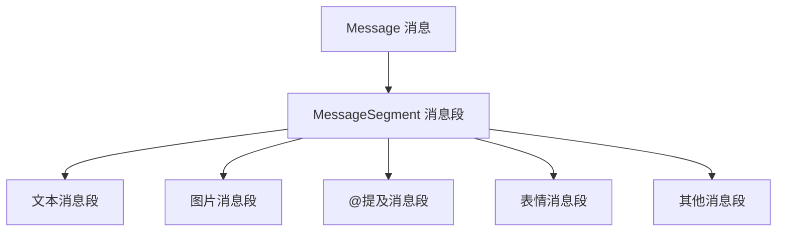

# 消息构建与发送

## 概述

在 YunBot 中,消息系统是机器人与用户交互的核心。本指南将详细介绍如何构建各种类型的消息,以及如何发送消息到不同的目标。

YunBot 的消息系统基于 OneBot v11 协议标准,支持丰富的消息类型和灵活的消息构建方式。消息由一个或多个**消息段** (MessageSegment) 组成,每个消息段代表一种特定类型的内容。

### 消息系统组成



## MessageSegment 消息段

消息段 (MessageSegment) 是构成消息的基本单元。每个消息段都有一个类型 (type) 和相应的数据 (data)。

### 基本消息段类型

#### 1. 文本消息

文本消息是最常用的消息类型,用于发送纯文本内容。

```python
from yunbot import MessageSegment

# 创建文本消息段
text_seg = MessageSegment.text("你好,欢迎使用 YunBot!")

# 文本消息段的属性
print(text_seg.type)  # 输出: text
print(text_seg.data)  # 输出: {"text": "你好,欢迎使用 YunBot!"}
```

#### 2. 表情消息

QQ 表情使用表情 ID 来标识不同的表情。

```python
# 创建表情消息段
face_seg = MessageSegment.face(178)  # 178 是笑脸表情的 ID

# 常用表情 ID
# 178: 笑脸
# 177: 难过
# 179: 色
# 180: 发呆
# 更多表情 ID 请参考 OneBot v11 文档
```

#### 3. @提及消息

在群聊中提及 (@) 特定用户。

```python
# @单个用户
at_seg = MessageSegment.at(123456789)  # 传入用户 QQ 号

# @全体成员
at_all_seg = MessageSegment.at_all()
```

### 多媒体消息段

#### 1. 图片消息

发送图片支持多种方式:本地文件路径、网络 URL、Base64 编码等。

```python
# 方式一: 使用网络 URL
image_seg = MessageSegment.image(
    file="https://example.com/image.jpg",
    type="show"  # 图片类型: show (普通), flash (闪照)
)

# 方式二: 使用本地文件路径
image_seg = MessageSegment.image(
    file="file:///path/to/image.jpg"
)

# 方式三: 使用 Base64 编码
image_seg = MessageSegment.image(
    file="base64://iVBORw0KGgoAAAANSUhEUgAAAAEAAAABCAYAAAAfFcSJAAAADUlEQVR42mNk+M9QDwADhgGAWjR9awAAAABJRU5ErkJggg=="
)

# 带缓存和代理选项
image_seg = MessageSegment.image(
    file="https://example.com/image.jpg",
    type="show",
    cache=True,   # 是否使用缓存
    proxy=False,  # 是否使用代理
    timeout=30    # 下载超时时间(秒)
)
```

#### 2. 语音消息

发送语音消息 (仅支持群聊)。

```python
# 发送语音消息
record_seg = MessageSegment.record(
    file="file:///path/to/audio.amr"  # 支持 amr、silk 格式
)

# 带变声效果
record_seg = MessageSegment.record(
    file="file:///path/to/audio.amr",
    magic=True  # 启用变声
)
```

#### 3. 视频消息

发送短视频消息。

```python
# 发送视频消息
video_seg = MessageSegment.video(
    file="file:///path/to/video.mp4",
    cache=True
)
```

### 特殊消息段

#### 1. 回复消息

回复指定的消息。

```python
# 回复某条消息 (需要消息 ID)
reply_seg = MessageSegment.reply(12345678)  # 传入要回复的消息 ID

# 在消息中使用回复
from yunbot import Message

# 构建回复消息
reply_msg = Message([
    MessageSegment.reply(12345678),
    MessageSegment.text("这是对你消息的回复")
])
```

#### 2. 分享链接

分享网页链接。

```python
# 创建分享消息段
share_seg = MessageSegment.share(
    url="https://github.com/yang208115/YunBot",
    title="YunBot - OneBot v11 客户端",
    content="功能完整、易于使用的 OneBot v11 协议客户端库",
    image="https://github.com/yang208115/YunBot/logo.png"  # 分享卡片的图片
)
```

#### 3. 位置消息

发送地理位置信息。

```python
# 发送位置消息
location_seg = MessageSegment.location(
    lat=39.9042,    # 纬度
    lon=116.4074,   # 经度
    title="天安门",
    content="北京市东城区"
)
```

#### 4. 音乐分享

分享音乐卡片。

```python
# 方式一: 使用音乐平台 ID
music_seg = MessageSegment.music(
    type_="qq",      # 音乐平台: qq, 163, xm (QQ音乐、网易云、虾米)
    id_="001aBCD"   # 音乐 ID
)

# 方式二: 自定义音乐卡片
music_seg = MessageSegment.music(
    type_="custom",
    url="https://example.com/music.html",
    audio="https://example.com/music.mp3",
    title="歌曲名称",
    content="歌手名称",
    image="https://example.com/cover.jpg"
)
```

### 高级消息段

#### 1. XML 和 JSON 消息

发送富文本卡片消息。

```python
# XML 消息
xml_seg = MessageSegment.xml(
    data='<?xml version="1.0" encoding="UTF-8"?><msg>...</msg>'
)

# JSON 消息
json_seg = MessageSegment.json_data(
    data='{"app":"com.tencent.xxxxx","view":"xxx"}'
)
```

#### 2. 合并转发消息

创建合并转发消息的节点。

```python
# 创建消息节点
node1 = MessageSegment.node(
    name="用户1",
    uin=123456789,
    content=[MessageSegment.text("第一条消息")]
)

node2 = MessageSegment.node(
    name="用户2",
    uin=987654321,
    content=[MessageSegment.text("第二条消息")]
)

# 发送合并转发消息需要使用特定的 API
# 请参考 API 文档中的 send_group_forward_msg 方法
```

#### 3. 其他消息段

```python
# 猜拳 (石头剪刀布)
rps_seg = MessageSegment.rps()

# 骰子
dice_seg = MessageSegment.dice()

# 窗口抖动 (戳一戳)
shake_seg = MessageSegment.shake()

# 戳一戳
poke_seg = MessageSegment.poke(type_="1", id_="1")

# 匿名发送 (仅群聊)
anonymous_seg = MessageSegment.anonymous()

# 推荐好友/群
contact_seg = MessageSegment.contact(
    type_="qq",      # 类型: qq (好友), group (群)
    id_=123456789   # QQ号或群号
)
```

## Message 消息对象

Message 是由多个 MessageSegment 组成的完整消息。它提供了丰富的方法来操作和处理消息。

### 创建消息

#### 方式一: 从字符串创建

```python
from yunbot import Message

# 直接从字符串创建
msg = Message("这是一条简单的文本消息")

# 从包含 CQ 码的字符串创建
msg = Message("[CQ:face,id=178]你好[CQ:at,qq=123456789]")
```

#### 方式二: 从消息段列表创建

```python
# 使用消息段列表创建
msg = Message([
    MessageSegment.text("你好,"),
    MessageSegment.at(123456789),
    MessageSegment.text("!"),
    MessageSegment.face(178)
])
```

#### 方式三: 从字典创建

```python
# 从字典表示创建
msg_dict = [
    {"type": "text", "data": {"text": "你好"}},
    {"type": "face", "data": {"id": 178}}
]
msg = Message.from_dict(msg_dict)
```

### 消息构建

#### 使用 + 运算符拼接

```python
from yunbot import MessageSegment

# 使用 + 运算符拼接消息段
msg = MessageSegment.text("你好,") + MessageSegment.at(123456789) + MessageSegment.text("!")

# 拼接多个消息段
msg = (
    MessageSegment.text("欢迎 ") +
    MessageSegment.at(123456789) +
    MessageSegment.text(" 加入群聊!\n") +
    MessageSegment.face(178)
)
```

#### 使用列表构建

```python
# 使用列表方式构建消息
msg = Message([
    MessageSegment.text("🤖 机器人命令帮助:\n\n"),
    MessageSegment.text("📝 基础命令:\n"),
    MessageSegment.text("/help - 显示此帮助信息\n"),
    MessageSegment.text("/echo <内容> - 回显消息\n"),
    MessageSegment.face(178)
])
```

### 消息操作

Message 对象支持类似列表的操作方法。

```python
from yunbot import Message, MessageSegment

msg = Message([MessageSegment.text("你好")])

# 添加消息段
msg.append(MessageSegment.face(178))

# 插入消息段
msg.insert(0, MessageSegment.at(123456789))

# 扩展消息
msg.extend([
    MessageSegment.text(" 欢迎!"),
    MessageSegment.face(179)
])

# 删除消息段
del msg[0]

# 获取消息段
first_seg = msg[0]

# 获取消息长度 (消息段数量)
length = len(msg)

# 遍历消息段
for segment in msg.segments():
    print(f"消息段类型: {segment.type}")

# 清空消息
msg.clear()
```

### 消息解析

```python
from yunbot import Message

msg = Message([
    MessageSegment.text("你好"),
    MessageSegment.at(123456789),
    MessageSegment.text("欢迎!"),
    MessageSegment.face(178)
])

# 提取纯文本内容
plain_text = msg.extract_plain_text()
print(plain_text)  # 输出: 你好欢迎!

# 获取指定类型的消息段
text_segments = msg.get_segments("text")
at_segments = msg.get_segments("at")

# 检查是否包含某种类型的消息段
has_image = msg.has_segment("image")
has_at = msg.has_segment("at")

# 检查是否只包含文本消息段
is_text_only = msg.is_text_only()

# 检查消息中是否包含某个文本
if "你好" in msg:
    print("消息中包含'你好'")

# 转换为字典
msg_dict = msg.to_dict()
print(msg_dict)
# 输出: [
#   {"type": "text", "data": {"text": "你好"}},
#   {"type": "at", "data": {"qq": "123456789"}},
#   ...
# ]
```

## 消息发送

YunBot 提供了多种消息发送方法,可以向不同的目标发送消息。

### 发送私聊消息

```python
import asyncio
from yunbot import OneBotClient, Message, MessageSegment

async def main():
    client = OneBotClient.create_simple_client(
        connection_type="websocket",
        url="ws://localhost:3001"
    )
    
    await client.start()
    
    # 方式一: 发送文本消息
    await client.send_private_msg(
        user_id=123456789,
        message="你好,这是一条私聊消息"
    )
    
    # 方式二: 发送 Message 对象
    msg = Message([
        MessageSegment.text("你好!"),
        MessageSegment.face(178)
    ])
    await client.send_private_msg(user_id=123456789, message=msg)
    
    # 方式三: 发送消息段列表
    await client.send_private_msg(
        user_id=123456789,
        message=[
            MessageSegment.text("这是图片:"),
            MessageSegment.image(file="https://example.com/image.jpg")
        ]
    )
    
    await client.stop()

asyncio.run(main())
```

### 发送群消息

```python
async def send_group_message_example():
    client = OneBotClient.create_simple_client(
        connection_type="websocket",
        url="ws://localhost:3001"
    )
    
    await client.start()
    
    # 发送群消息
    await client.send_group_msg(
        group_id=987654321,
        message="你好,这是一条群消息"
    )
    
    # 发送复杂的群消息
    msg = Message([
        MessageSegment.at(123456789),
        MessageSegment.text(" 你好!\n"),
        MessageSegment.text("这是一张图片:\n"),
        MessageSegment.image(file="https://example.com/image.jpg")
    ])
    await client.send_group_msg(group_id=987654321, message=msg)
    
    await client.stop()
```

### 在事件处理器中发送消息

通常我们会在事件处理器中根据接收到的消息进行回复。

```python
from yunbot import OneBotClient, Message, MessageSegment

async def main():
    client = OneBotClient.create_simple_client(
        connection_type="websocket",
        url="ws://localhost:3001"
    )
    
    @client.on_message
    async def handle_message(event):
        """处理消息事件并回复"""
        # 构建回复消息
        reply_msg = Message([
            MessageSegment.text("你好!我收到了你的消息:\n"),
            MessageSegment.text(str(event.message))
        ])
        
        # 根据消息来源发送回复
        if hasattr(event, 'group_id'):
            # 群消息回复
            await client.send_group_msg(
                group_id=event.group_id,
                message=reply_msg
            )
        else:
            # 私聊消息回复
            await client.send_private_msg(
                user_id=event.user_id,
                message=reply_msg
            )
    
    await client.start()
    await client.run_forever()

asyncio.run(main())
```

### 消息撤回

撤回已发送的消息。

```python
async def recall_message_example():
    # 发送消息会返回消息 ID
    result = await client.send_group_msg(
        group_id=987654321,
        message="这条消息将被撤回"
    )
    
    message_id = result.get("message_id")
    
    # 等待 3 秒后撤回消息
    await asyncio.sleep(3)
    await client.delete_msg(message_id=message_id)
```

## 完整示例

### 示例 1: 多类型消息发送

```python
import asyncio
from yunbot import OneBotClient, Message, MessageSegment

async def main():
    client = OneBotClient.create_simple_client(
        connection_type="websocket",
        url="ws://localhost:3001",
        access_token="your_token"
    )
    
    await client.start()
    
    # 发送包含多种消息段的消息
    rich_msg = Message([
        MessageSegment.text("🎉 欢迎使用 YunBot!\n\n"),
        MessageSegment.text("📝 这是文本消息\n"),
        MessageSegment.face(178),
        MessageSegment.text("\n\n"),
        MessageSegment.text("🖼️ 这是图片消息:\n"),
        MessageSegment.image(file="https://http.cat/200.jpg"),
        MessageSegment.text("\n\n"),
        MessageSegment.text("🎵 这是音乐分享:\n"),
        MessageSegment.music(type_="qq", id_="001aBCD")
    ])
    
    await client.send_group_msg(group_id=987654321, message=rich_msg)
    
    await client.stop()

asyncio.run(main())
```

### 示例 2: 命令式消息处理

```python
import asyncio
from yunbot import OneBotClient, Message, MessageSegment

async def main():
    client = OneBotClient.create_simple_client(
        connection_type="websocket",
        url="ws://localhost:3001"
    )
    
    @client.on_message
    async def handle_message(event):
        # 提取纯文本内容
        msg = Message(event.message)
        text = msg.extract_plain_text().strip()
        
        # 命令处理
        if text == "/help":
            help_msg = Message([
                MessageSegment.text("🤖 可用命令:\n"),
                MessageSegment.text("/help - 显示帮助\n"),
                MessageSegment.text("/time - 显示时间\n"),
                MessageSegment.text("/echo <内容> - 回显消息\n")
            ])
            
            if hasattr(event, 'group_id'):
                await client.send_group_msg(event.group_id, help_msg)
            else:
                await client.send_private_msg(event.user_id, help_msg)
        
        elif text == "/time":
            import datetime
            now = datetime.datetime.now().strftime("%Y-%m-%d %H:%M:%S")
            time_msg = MessageSegment.text(f"⏰ 当前时间: {now}")
            
            if hasattr(event, 'group_id'):
                await client.send_group_msg(event.group_id, time_msg)
            else:
                await client.send_private_msg(event.user_id, time_msg)
        
        elif text.startswith("/echo "):
            echo_content = text[6:]  # 去掉 "/echo " 前缀
            echo_msg = MessageSegment.text(f"🔁 回显: {echo_content}")
            
            if hasattr(event, 'group_id'):
                await client.send_group_msg(event.group_id, echo_msg)
            else:
                await client.send_private_msg(event.user_id, echo_msg)
    
    await client.start()
    await client.run_forever()

asyncio.run(main())
```

### 示例 3: 欢迎新成员

```python
import asyncio
from yunbot import OneBotClient, Message, MessageSegment

async def main():
    client = OneBotClient.create_simple_client(
        connection_type="websocket",
        url="ws://localhost:3001"
    )
    
    @client.on_notice
    async def handle_notice(event):
        # 监听群成员增加事件
        if event.notice_type == "group_increase":
            # 构建欢迎消息
            welcome_msg = Message([
                MessageSegment.text("🎉 欢迎 "),
                MessageSegment.at(event.user_id),
                MessageSegment.text(" 加入本群!\n\n"),
                MessageSegment.text("📖 请阅读群公告\n"),
                MessageSegment.text("💬 有问题请@管理员\n"),
                MessageSegment.face(178)
            ])
            
            # 发送欢迎消息
            await client.send_group_msg(event.group_id, welcome_msg)
    
    await client.start()
    await client.run_forever()

asyncio.run(main())
```

## 最佳实践

### 1. 消息构建

```python
# ✅ 推荐: 使用 Message 对象构建复杂消息
msg = Message([
    MessageSegment.text("内容1"),
    MessageSegment.face(178),
    MessageSegment.text("内容2")
])

# ✅ 推荐: 使用 + 运算符拼接简单消息
msg = MessageSegment.text("你好,") + MessageSegment.at(123) + MessageSegment.text("!")

# ❌ 不推荐: 手动构建字典
msg = [
    {"type": "text", "data": {"text": "内容"}},
    {"type": "face", "data": {"id": 178}}
]
```

### 2. 消息发送

```python
# ✅ 推荐: 使用异步发送
await client.send_group_msg(group_id, message)

# ✅ 推荐: 捕获发送错误
try:
    await client.send_group_msg(group_id, message)
except Exception as e:
    logger.error(f"发送消息失败: {e}")

# ✅ 推荐: 在事件处理器中统一发送逻辑
async def send_to_event(client, event, message):
    """统一的消息发送函数"""
    if hasattr(event, 'group_id'):
        await client.send_group_msg(event.group_id, message)
    else:
        await client.send_private_msg(event.user_id, message)
```

### 3. 消息解析

```python
# ✅ 推荐: 使用 extract_plain_text 提取文本
msg = Message(event.message)
text = msg.extract_plain_text()

# ✅ 推荐: 使用 get_segments 获取特定类型消息段
images = msg.get_segments("image")
for img in images:
    print(f"图片 URL: {img.data.get('file')}")

# ✅ 推荐: 使用 has_segment 检查消息类型
if msg.has_segment("at"):
    print("消息中包含@提及")
```

### 4. 错误处理

```python
# ✅ 推荐: 完善的错误处理
from yunbot import ActionFailed, NetworkException

try:
    result = await client.send_group_msg(group_id, message)
    message_id = result.get("message_id")
    print(f"消息发送成功,消息 ID: {message_id}")
except ActionFailed as e:
    logger.error(f"API 调用失败: {e}")
except NetworkException as e:
    logger.error(f"网络错误: {e}")
except Exception as e:
    logger.error(f"未知错误: {e}")
```

### 5. 性能优化

```python
# ✅ 推荐: 批量发送时添加延迟,避免触发风控
async def send_batch_messages(client, group_id, messages):
    """批量发送消息"""
    for msg in messages:
        await client.send_group_msg(group_id, msg)
        await asyncio.sleep(1)  # 每条消息间隔 1 秒

# ✅ 推荐: 复用 Message 对象
template_msg = Message([
    MessageSegment.text("欢迎 "),
    MessageSegment.text("!")  # 占位符
])

# 修改消息内容后发送
for user_id in user_list:
    msg = Message(template_msg.to_dict())  # 复制模板
    msg.insert(1, MessageSegment.at(user_id))
    await client.send_group_msg(group_id, msg)
```

## 注意事项

1. **消息长度限制**: QQ 对消息长度有限制,过长的消息可能会被截断或发送失败
2. **发送频率**: 频繁发送消息可能触发 QQ 的风控机制,建议添加适当的延迟
3. **图片格式**: 图片格式建议使用 jpg、png,大小不超过 10MB
4. **语音格式**: 语音消息仅支持 amr、silk 格式
5. **权限要求**: 某些操作(如@全体成员)需要相应的群权限
6. **消息撤回**: 撤回消息有时间限制(通常为 2 分钟内)

## 相关文档

- [客户端使用](client.md) - 了解客户端的创建和管理
- [事件处理](events.md) - 学习如何处理各种事件
- [API 参考 - 消息 API](../api/message.md) - 查看完整的消息相关 API
- [示例 - 命令处理机器人](../examples/command-bot.md) - 查看命令式机器人的完整示例
